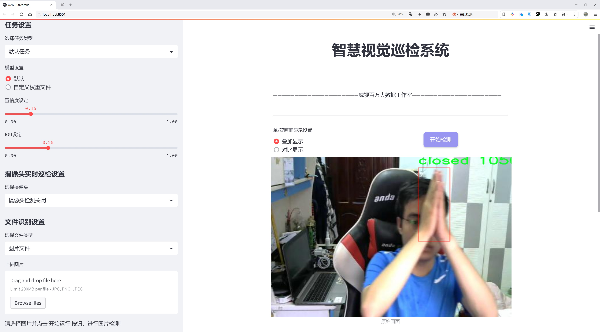
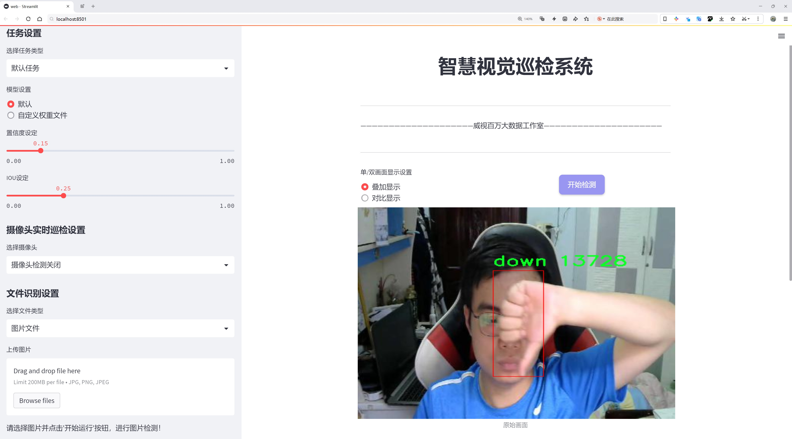
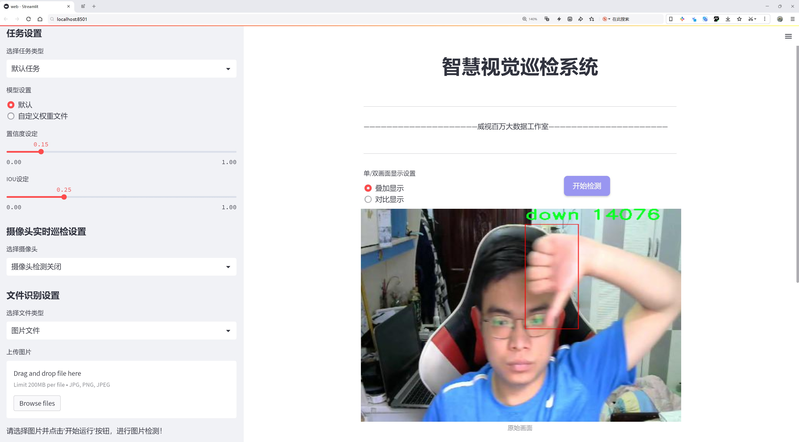
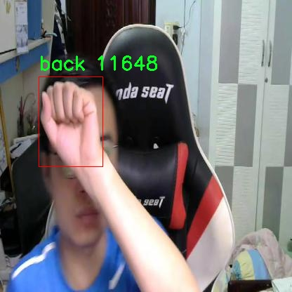
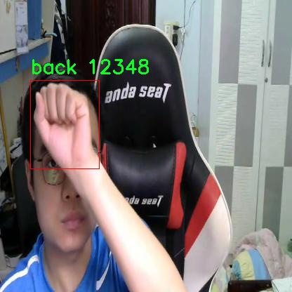
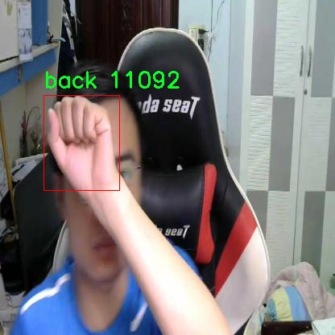
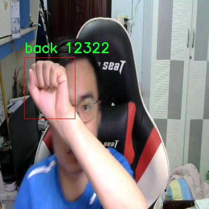

# 手势识别检测系统源码分享
 # [一条龙教学YOLOV8标注好的数据集一键训练_70+全套改进创新点发刊_Web前端展示]

### 1.研究背景与意义

项目参考[AAAI Association for the Advancement of Artificial Intelligence](https://gitee.com/qunshansj/projects)

项目来源[AACV Association for the Advancement of Computer Vision](https://gitee.com/qunmasj/projects)

研究背景与意义

随着人机交互技术的迅速发展，手势识别作为一种自然、直观的交互方式，逐渐受到广泛关注。手势识别不仅在智能家居、虚拟现实、增强现实等领域展现出巨大的应用潜力，还在医疗、教育和安全监控等多个行业中发挥着重要作用。传统的手势识别方法多依赖于复杂的传感器和设备，然而，随着深度学习技术的进步，基于图像的手势识别逐渐成为研究的热点。尤其是YOLO（You Only Look Once）系列模型因其高效的实时目标检测能力而被广泛应用于手势识别任务中。

YOLOv8作为YOLO系列的最新版本，结合了更先进的网络结构和训练策略，具备了更强的特征提取能力和更快的推理速度。然而，尽管YOLOv8在目标检测方面表现出色，但在手势识别这一特定任务中，仍然面临着诸多挑战。手势的多样性、复杂性以及不同环境下的光照变化，都会对识别精度产生影响。因此，改进YOLOv8以提升其在手势识别中的性能，具有重要的研究意义。

本研究所使用的数据集包含2100张手势图像，涵盖了9种不同的手势类别，包括“back”、“closed”、“down”、“forward”、“left”、“open”、“right”、“stop”和“up”。这些手势不仅具有明确的物理特征，还在不同的文化和场景中具有不同的语义。通过对这些手势的深入分析和研究，可以为手势识别系统的设计提供丰富的基础数据支持。此外，数据集的多样性使得模型在训练过程中能够学习到更加全面的手势特征，从而提高其在实际应用中的适应性和鲁棒性。

在研究过程中，改进YOLOv8的手势识别系统将通过引入数据增强、特征融合等技术手段，提升模型的泛化能力和识别精度。数据增强技术可以通过对原始图像进行旋转、缩放、翻转等操作，生成更多的训练样本，从而有效缓解过拟合问题。特征融合则可以通过结合不同层次的特征信息，提升模型对复杂手势的识别能力。此外，针对手势的动态变化，研究还将探讨如何利用时序信息来增强模型的识别效果。

综上所述，基于改进YOLOv8的手势识别系统的研究，不仅能够推动手势识别技术的发展，还将为相关领域的应用提供有力支持。通过提升手势识别的准确性和实时性，本研究有望在智能交互、辅助设备、教育培训等多个领域产生深远的影响。未来，随着技术的不断进步和应用场景的不断拓展，手势识别系统将成为人机交互的重要组成部分，为人们的生活和工作带来更多便利与创新。

### 2.图片演示







##### 注意：由于此博客编辑较早，上面“2.图片演示”和“3.视频演示”展示的系统图片或者视频可能为老版本，新版本在老版本的基础上升级如下：（实际效果以升级的新版本为准）

  （1）适配了YOLOV8的“目标检测”模型和“实例分割”模型，通过加载相应的权重（.pt）文件即可自适应加载模型。

  （2）支持“图片识别”、“视频识别”、“摄像头实时识别”三种识别模式。

  （3）支持“图片识别”、“视频识别”、“摄像头实时识别”三种识别结果保存导出，解决手动导出（容易卡顿出现爆内存）存在的问题，识别完自动保存结果并导出到tempDir中。

  （4）支持Web前端系统中的标题、背景图等自定义修改，后面提供修改教程。

  另外本项目提供训练的数据集和训练教程,暂不提供权重文件（best.pt）,需要您按照教程进行训练后实现图片演示和Web前端界面演示的效果。

### 3.视频演示

[3.1 视频演示](https://www.bilibili.com/video/BV1WktYehESB/)

### 4.数据集信息展示

##### 4.1 本项目数据集详细数据（类别数＆类别名）

nc: 9
names: ['back', 'closed', 'down', 'foward', 'left', 'open', 'right', 'stop', 'up']


##### 4.2 本项目数据集信息介绍

数据集信息展示

在手势识别领域，数据集的构建与选择是实现高效模型训练的关键环节。本研究所采用的数据集名为“Hand Gestures”，其设计旨在为改进YOLOv8手势识别系统提供强有力的支持。该数据集包含九个类别，涵盖了多种常见的手势，这些手势在日常交流和人机交互中扮演着重要角色。具体类别包括：‘back’（后退）、‘closed’（闭合）、‘down’（向下）、‘forward’（向前）、‘left’（向左）、‘open’（打开）、‘right’（向右）、‘stop’（停止）和‘up’（向上）。这些手势不仅在不同文化和语言中具有普遍性，而且在各种应用场景中也有着广泛的适用性，例如智能家居控制、虚拟现实交互和机器人导航等。

“Hand Gestures”数据集的构建过程注重多样性与代表性，确保每个类别的手势在不同的背景、光照条件和手部姿态下均有充分的样本。这种多样性使得训练出的模型能够更好地适应现实环境中的变化，提高其在实际应用中的鲁棒性和准确性。此外，数据集中每个手势的样本数量均衡，避免了因类别不平衡而导致的模型偏倚，从而提升了模型的整体性能。

在数据采集过程中，研究团队使用了高分辨率的摄像设备，以确保每个手势的细节清晰可辨。数据集中的图像经过精心标注，确保每个手势的边界框准确无误。这种精确的标注为YOLOv8模型的训练提供了坚实的基础，使其能够有效地学习到不同手势的特征，并在实际应用中实现高效的识别。

为了进一步增强数据集的实用性，研究团队还考虑了手势的动态变化。除了静态图像，数据集中还包含了一些手势的动态视频片段。这些视频片段展示了手势的起始、过程和结束状态，帮助模型学习到手势在时间维度上的变化特征。这种动态信息的引入，使得模型在处理实时手势识别任务时，能够更好地理解手势的连续性和流畅性。

此外，数据集的设计还考虑到了不同用户的手部特征差异。为此，数据集中包含了来自不同年龄、性别和种族的用户所做的手势样本。这种多样性不仅增强了模型的泛化能力，也使其在面对不同用户时能够保持较高的识别准确率。

总之，“Hand Gestures”数据集为改进YOLOv8手势识别系统提供了丰富的训练素材。通过精心设计的类别、均衡的样本分布以及多样化的采集方式，该数据集不仅为模型的训练提供了坚实的基础，也为未来的研究和应用奠定了良好的基础。随着手势识别技术的不断发展和应用场景的不断扩展，基于该数据集训练出的模型将有望在智能交互、虚拟现实等领域发挥重要作用。










### 5.全套项目环境部署视频教程（零基础手把手教学）

[5.1 环境部署教程链接（零基础手把手教学）](https://www.ixigua.com/7404473917358506534?logTag=c807d0cbc21c0ef59de5)


[5.2 安装Python虚拟环境创建和依赖库安装视频教程链接（零基础手把手教学）](https://www.ixigua.com/7404474678003106304?logTag=1f1041108cd1f708b01a)

### 6.手把手YOLOV8训练视频教程（零基础小白有手就能学会）

[6.1 手把手YOLOV8训练视频教程（零基础小白有手就能学会）](https://www.ixigua.com/7404477157818401292?logTag=d31a2dfd1983c9668658)

### 7.70+种全套YOLOV8创新点代码加载调参视频教程（一键加载写好的改进模型的配置文件）

[7.1 70+种全套YOLOV8创新点代码加载调参视频教程（一键加载写好的改进模型的配置文件）](https://www.ixigua.com/7404478314661806627?logTag=29066f8288e3f4eea3a4)

### 8.70+种全套YOLOV8创新点原理讲解（非科班也可以轻松写刊发刊，V10版本正在科研待更新）

由于篇幅限制，每个创新点的具体原理讲解就不一一展开，具体见下列网址中的创新点对应子项目的技术原理博客网址【Blog】：


[8.1 70+种全套YOLOV8创新点原理讲解链接](https://gitee.com/qunmasj/good)

### 9.系统功能展示（检测对象为举例，实际内容以本项目数据集为准）

图9.1.系统支持检测结果表格显示

  图9.2.系统支持置信度和IOU阈值手动调节

  图9.3.系统支持自定义加载权重文件best.pt(需要你通过步骤5中训练获得)

  图9.4.系统支持摄像头实时识别

  图9.5.系统支持图片识别

  图9.6.系统支持视频识别

  图9.7.系统支持识别结果文件自动保存

  图9.8.系统支持Excel导出检测结果数据


### 10.原始YOLOV8算法原理

原始YOLOv8算法原理

YOLOv8作为YOLO系列的最新版本，于2023年1月由Ultralytics公司发布，标志着目标检测技术的又一次重大进步。与之前的YOLO版本相比，YOLOv8在算法架构、特征提取和目标定位等多个方面进行了优化，尤其是在处理复杂环境下的小目标检测时展现出了更高的精度和速度。其核心理念是将整个图像作为输入，通过深度学习网络直接进行目标检测和定位，避免了传统方法中滑动窗口和区域提议的复杂性，从而显著提高了检测效率。

YOLOv8的网络结构主要由四个模块组成：输入端、主干网络、Neck端和输出端。输入端负责对输入图像进行预处理，包括Mosaic数据增强、自适应图像缩放和灰度填充等操作。这些预处理步骤旨在增强数据的多样性，使得模型在训练过程中能够更好地适应不同的场景和条件。主干网络则采用了深层卷积神经网络结构，通过卷积、池化等操作提取图像特征。特别是引入了C2f和SPPF结构，使得特征提取更加高效和准确。

在Neck端，YOLOv8采用了基于路径聚合网络（PAN）的设计，通过上采样、下采样和特征拼接等操作融合不同尺度的特征图。这种特征融合方法能够有效地保留图像中的多尺度信息，从而提高模型对不同大小目标的检测能力。输出端则使用了解耦头（decoupled head）结构，将分类和回归过程分开处理，这样可以更好地匹配正负样本并计算损失。YOLOv8在损失计算方面采用了二元交叉熵（BCE）计算分类损失，并使用分布焦点损失（DFL）和完全交并比（CIoU）损失函数计算回归损失，从而提升了模型的整体性能。

值得注意的是，YOLOv8摒弃了传统的anchor-based检测方法，转而采用了anchor-free策略。这一转变使得YOLOv8在检测精度和速度上都有了显著提升。尤其是在复杂背景下的小目标检测中，YOLOv8展现出了更强的鲁棒性和适应性。然而，尽管YOLOv8在许多场景中表现出色，但在复杂水面环境下，仍然存在着定位误差和对小目标感知能力不足的问题。这主要是由于小目标漂浮物的特征复杂，背景多样化所导致的。

为了解决YOLOv8在特定应用场景中的不足，研究者们提出了YOLOv8-WSSOD算法的改进方案。该方案的核心在于引入了捕获远程依赖的思想，采用BiFormer双层路由注意力机制构建C2fBF模块。这一模块的设计旨在减轻主干网络下采样过程中的噪声影响，保留特征提取过程中更细粒度的上下文信息，从而提升模型对小目标的感知能力。此外，针对小目标漏检的问题，YOLOv8-WSSOD还添加了一个更小的检测头，以增强网络对小目标的检测能力。同时，在Neck端引入GSConv和Slim-neck技术，以保持检测精度的同时降低计算量。

最后，YOLOv8-WSSOD还通过使用MPDIoU损失函数替换CIoU损失函数，进一步提高了模型的泛化能力和精准度。这一系列的改进使得YOLOv8-WSSOD在复杂环境下的目标检测性能得到了显著提升，为未来的研究和应用提供了更为强大的工具。

总的来说，YOLOv8作为一种先进的目标检测算法，凭借其高效的网络结构和创新的技术手段，成功地在实时检测领域达到了新的高度。尽管在特定复杂环境下仍存在一些挑战，但通过不断的研究和改进，YOLOv8及其衍生算法有望在更广泛的应用场景中发挥重要作用。随着目标检测技术的不断进步，YOLOv8无疑将为智能监控、自动驾驶和人脸识别等领域带来新的机遇和挑战。


### 11.项目核心源码讲解（再也不用担心看不懂代码逻辑）

#### 11.1 70+种YOLOv8算法改进源码大全和调试加载训练教程（非必要）\ultralytics\models\fastsam\utils.py

以下是经过简化和注释的核心代码部分：

```python
import torch

def adjust_bboxes_to_image_border(boxes, image_shape, threshold=20):
    """
    调整边界框，使其靠近图像边界，如果它们在一定阈值内。

    参数:
        boxes (torch.Tensor): 边界框坐标，形状为 (n, 4)
        image_shape (tuple): 图像的高度和宽度，形状为 (height, width)
        threshold (int): 像素阈值

    返回:
        adjusted_boxes (torch.Tensor): 调整后的边界框
    """
    h, w = image_shape  # 获取图像的高度和宽度

    # 调整边界框的位置
    boxes[boxes[:, 0] < threshold, 0] = 0  # 将左上角x坐标小于阈值的设置为0
    boxes[boxes[:, 1] < threshold, 1] = 0  # 将左上角y坐标小于阈值的设置为0
    boxes[boxes[:, 2] > w - threshold, 2] = w  # 将右下角x坐标大于图像宽度减去阈值的设置为图像宽度
    boxes[boxes[:, 3] > h - threshold, 3] = h  # 将右下角y坐标大于图像高度减去阈值的设置为图像高度
    return boxes  # 返回调整后的边界框

def bbox_iou(box1, boxes, iou_thres=0.9, image_shape=(640, 640), raw_output=False):
    """
    计算一个边界框与其他边界框的交并比（IoU）。

    参数:
        box1 (torch.Tensor): 单个边界框，形状为 (4, )
        boxes (torch.Tensor): 一组边界框，形状为 (n, 4)
        iou_thres (float): IoU阈值
        image_shape (tuple): 图像的高度和宽度，形状为 (height, width)
        raw_output (bool): 如果为True，返回原始IoU值而不是索引

    返回:
        high_iou_indices (torch.Tensor): IoU大于阈值的边界框索引
    """
    boxes = adjust_bboxes_to_image_border(boxes, image_shape)  # 调整边界框到图像边界

    # 计算交集的坐标
    x1 = torch.max(box1[0], boxes[:, 0])  # 交集左上角x坐标
    y1 = torch.max(box1[1], boxes[:, 1])  # 交集左上角y坐标
    x2 = torch.min(box1[2], boxes[:, 2])  # 交集右下角x坐标
    y2 = torch.min(box1[3], boxes[:, 3])  # 交集右下角y坐标

    # 计算交集面积
    intersection = (x2 - x1).clamp(0) * (y2 - y1).clamp(0)  # clamp(0)确保不出现负值

    # 计算两个边界框的面积
    box1_area = (box1[2] - box1[0]) * (box1[3] - box1[1])  # box1的面积
    box2_area = (boxes[:, 2] - boxes[:, 0]) * (boxes[:, 3] - boxes[:, 1])  # boxes的面积

    # 计算并集面积
    union = box1_area + box2_area - intersection  # 并集面积 = A + B - 交集

    # 计算IoU
    iou = intersection / union  # IoU值，形状为 (n, )
    if raw_output:
        return 0 if iou.numel() == 0 else iou  # 如果需要原始IoU值，则返回

    # 返回IoU大于阈值的边界框索引
    return torch.nonzero(iou > iou_thres).flatten()
```

### 代码说明：
1. **adjust_bboxes_to_image_border**：此函数用于调整边界框的位置，确保它们不会超出图像的边界。如果边界框的某个边距离图像边界小于给定的阈值，则将其调整到图像边界上。

2. **bbox_iou**：此函数计算一个边界框与一组其他边界框之间的交并比（IoU）。它首先调用 `adjust_bboxes_to_image_border` 来确保所有边界框都在图像内，然后计算交集、面积和IoU值。根据 `raw_output` 参数，可以选择返回原始的IoU值或满足阈值条件的边界框索引。

这个文件是一个用于YOLO（You Only Look Once）目标检测算法的工具模块，主要包含两个函数，分别用于调整边界框（bounding boxes）和计算交并比（IoU）。

首先，`adjust_bboxes_to_image_border`函数的主要功能是将边界框调整到图像边界内，确保它们不会超出图像的范围。该函数接收三个参数：`boxes`是一个包含多个边界框的张量，每个边界框由四个坐标（x1, y1, x2, y2）表示；`image_shape`是一个元组，包含图像的高度和宽度；`threshold`是一个阈值，表示如果边界框的某个边距图像边界的距离小于该阈值，则将其调整到边界上。函数内部首先获取图像的高度和宽度，然后通过条件语句对边界框的坐标进行调整，确保它们在图像的有效范围内，最后返回调整后的边界框。

接下来的`bbox_iou`函数用于计算一个边界框与一组其他边界框之间的交并比。它的参数包括`box1`（待计算的边界框）、`boxes`（一组边界框）、`iou_thres`（IoU阈值）、`image_shape`（图像的高度和宽度）以及`raw_output`（一个布尔值，指示是否返回原始的IoU值）。函数首先调用`adjust_bboxes_to_image_border`来调整输入的边界框，确保它们在图像边界内。接着，函数计算交集的坐标，并通过这些坐标计算交集的面积。然后，函数计算两个边界框的面积，并通过交集的面积计算并集的面积。最后，函数计算IoU值，并根据`raw_output`的值决定返回原始的IoU值还是满足IoU阈值的边界框索引。

总的来说，这个模块提供了对边界框进行处理和评估的基本功能，为YOLO算法的目标检测任务提供了重要的支持。

#### 11.2 code\ultralytics\data\annotator.py

以下是代码中最核心的部分，并附上详细的中文注释：

```python
from pathlib import Path
from ultralytics import SAM, YOLO

def auto_annotate(data, det_model="yolov8x.pt", sam_model="sam_b.pt", device="", output_dir=None):
    """
    自动为图像添加注释，使用YOLO目标检测模型和SAM分割模型。

    参数:
        data (str): 包含待注释图像的文件夹路径。
        det_model (str, optional): 预训练的YOLO检测模型，默认为'yolov8x.pt'。
        sam_model (str, optional): 预训练的SAM分割模型，默认为'sam_b.pt'。
        device (str, optional): 运行模型的设备，默认为空字符串（CPU或可用的GPU）。
        output_dir (str | None | optional): 保存注释结果的目录。
            默认为与'data'相同目录下的'labels'文件夹。

    示例:
        auto_annotate(data='ultralytics/assets', det_model='yolov8n.pt', sam_model='mobile_sam.pt')
    """
    # 加载YOLO目标检测模型
    det_model = YOLO(det_model)
    # 加载SAM分割模型
    sam_model = SAM(sam_model)

    # 将数据路径转换为Path对象
    data = Path(data)
    # 如果未指定输出目录，则创建一个默认的输出目录
    if not output_dir:
        output_dir = data.parent / f"{data.stem}_auto_annotate_labels"
    # 创建输出目录（如果不存在）
    Path(output_dir).mkdir(exist_ok=True, parents=True)

    # 使用YOLO模型进行目标检测，stream=True表示实时流处理
    det_results = det_model(data, stream=True, device=device)

    # 遍历检测结果
    for result in det_results:
        # 获取检测到的类别ID
        class_ids = result.boxes.cls.int().tolist()  # noqa
        # 如果检测到的类别ID不为空
        if len(class_ids):
            # 获取边界框坐标
            boxes = result.boxes.xyxy  # Boxes对象用于边界框输出
            # 使用SAM模型进行分割，传入原始图像和边界框
            sam_results = sam_model(result.orig_img, bboxes=boxes, verbose=False, save=False, device=device)
            # 获取分割结果
            segments = sam_results[0].masks.xyn  # noqa

            # 将分割结果写入文本文件
            with open(f"{Path(output_dir) / Path(result.path).stem}.txt", "w") as f:
                for i in range(len(segments)):
                    s = segments[i]
                    # 如果分割结果为空，则跳过
                    if len(s) == 0:
                        continue
                    # 将分割结果转换为字符串并写入文件
                    segment = map(str, segments[i].reshape(-1).tolist())
                    f.write(f"{class_ids[i]} " + " ".join(segment) + "\n")
```

### 代码核心部分说明：
1. **模型加载**：加载YOLO和SAM模型，分别用于目标检测和图像分割。
2. **数据路径处理**：将输入数据路径转换为`Path`对象，并设置输出目录。
3. **目标检测**：使用YOLO模型对指定路径下的图像进行目标检测。
4. **图像分割**：对检测到的目标进行分割，获取分割结果。
5. **结果保存**：将每个图像的分割结果以文本文件的形式保存到指定的输出目录中。每行包含类别ID和对应的分割坐标。

这个程序文件的主要功能是自动标注图像，使用了YOLO（You Only Look Once）目标检测模型和SAM（Segment Anything Model）分割模型。函数`auto_annotate`接收多个参数，包括图像数据的路径、YOLO模型和SAM模型的文件名、设备信息以及输出目录。

首先，函数通过`YOLO`和`SAM`类加载预训练的目标检测模型和分割模型。接着，函数将输入的图像数据路径转换为`Path`对象，以便于后续的文件操作。如果没有指定输出目录，程序会在输入数据的同级目录下创建一个名为“{数据文件夹名}_auto_annotate_labels”的文件夹，用于存放标注结果。

接下来，函数调用YOLO模型对指定路径下的图像进行目标检测，返回检测结果。对于每一张检测到的图像，程序提取出检测到的类别ID和边界框坐标。如果检测到的类别ID不为空，程序会使用SAM模型对原始图像进行分割，传入之前得到的边界框。分割结果会以掩码的形式返回。

最后，程序将每个分割结果写入到对应的文本文件中，文件名与原始图像相同，后缀为`.txt`。每一行包含类别ID和分割的坐标信息，坐标信息经过处理后以字符串形式写入文件。

这个程序的设计使得用户可以方便地对一批图像进行自动标注，节省了手动标注的时间和精力。通过灵活的参数设置，用户可以选择不同的模型和输出路径，适应不同的需求。

#### 11.3 ui.py

```python
import sys
import subprocess

def run_script(script_path):
    """
    使用当前 Python 环境运行指定的脚本。

    Args:
        script_path (str): 要运行的脚本路径

    Returns:
        None
    """
    # 获取当前 Python 解释器的路径
    python_path = sys.executable

    # 构建运行命令
    command = f'"{python_path}" -m streamlit run "{script_path}"'

    # 执行命令
    result = subprocess.run(command, shell=True)
    if result.returncode != 0:
        print("脚本运行出错。")


# 实例化并运行应用
if __name__ == "__main__":
    # 指定您的脚本路径
    script_path = "web.py"  # 这里直接指定脚本路径

    # 运行脚本
    run_script(script_path)
```

### 代码核心部分及注释

1. **导入必要的模块**：
   ```python
   import sys
   import subprocess
   ```
   - `sys`模块用于访问与Python解释器相关的变量和函数，这里主要用来获取当前Python解释器的路径。
   - `subprocess`模块用于执行外部命令，这里用来运行指定的Python脚本。

2. **定义`run_script`函数**：
   ```python
   def run_script(script_path):
   ```
   - 该函数接受一个参数`script_path`，表示要运行的Python脚本的路径。

3. **获取当前Python解释器的路径**：
   ```python
   python_path = sys.executable
   ```
   - 使用`sys.executable`获取当前Python解释器的完整路径，以便在命令中调用。

4. **构建运行命令**：
   ```python
   command = f'"{python_path}" -m streamlit run "{script_path}"'
   ```
   - 使用f-string格式化字符串，构建运行命令，调用`streamlit`模块来运行指定的脚本。

5. **执行命令并检查结果**：
   ```python
   result = subprocess.run(command, shell=True)
   if result.returncode != 0:
       print("脚本运行出错。")
   ```
   - 使用`subprocess.run`执行构建的命令，`shell=True`表示在shell中执行。
   - 检查返回码，如果不为0，表示脚本运行出错，打印错误信息。

6. **主程序入口**：
   ```python
   if __name__ == "__main__":
       script_path = "web.py"  # 这里直接指定脚本路径
       run_script(script_path)
   ```
   - 该部分确保只有在直接运行该脚本时才会执行，指定要运行的脚本路径，并调用`run_script`函数执行该脚本。

这个程序文件名为 `ui.py`，其主要功能是通过当前的 Python 环境运行一个指定的脚本。代码首先导入了必要的模块，包括 `sys`、`os` 和 `subprocess`，以及一个自定义的路径处理模块 `abs_path`。

在 `run_script` 函数中，首先获取当前 Python 解释器的路径，存储在 `python_path` 变量中。接着，构建一个命令字符串，该命令使用 `streamlit` 模块来运行指定的脚本。命令的格式为 `"{python_path}" -m streamlit run "{script_path}"`，其中 `script_path` 是传入的参数，表示要运行的脚本的路径。

随后，使用 `subprocess.run` 方法执行构建好的命令。该方法的 `shell=True` 参数允许在 shell 中执行命令。执行后，检查返回的结果码，如果不为零，表示脚本运行出错，并打印出错信息。

在文件的最后部分，使用 `if __name__ == "__main__":` 语句来确保只有在直接运行该文件时才会执行以下代码。这里指定了要运行的脚本路径为 `web.py`，并调用 `run_script` 函数来执行这个脚本。

总体来说，这个程序的主要作用是封装了一个运行指定 Python 脚本的功能，方便用户通过命令行来启动一个基于 Streamlit 的 Web 应用。

#### 11.4 code\ultralytics\nn\modules\block.py

以下是经过简化和注释的核心代码部分，主要保留了 YOLO 模型中的重要模块和结构：

```python
import torch
import torch.nn as nn
import torch.nn.functional as F

class DFL(nn.Module):
    """
    分布焦点损失（DFL）模块。
    用于计算目标检测中的损失。
    """

    def __init__(self, c1=16):
        """初始化卷积层，输入通道数为 c1。"""
        super().__init__()
        # 创建一个卷积层，将 c1 通道的输入映射到 1 通道的输出
        self.conv = nn.Conv2d(c1, 1, 1, bias=False).requires_grad_(False)
        # 初始化卷积层的权重为 [0, 1, ..., c1-1]
        x = torch.arange(c1, dtype=torch.float)
        self.conv.weight.data[:] = nn.Parameter(x.view(1, c1, 1, 1))
        self.c1 = c1

    def forward(self, x):
        """前向传播，应用卷积层并返回结果。"""
        b, c, a = x.shape  # b: batch size, c: channels, a: anchors
        # 变形并应用 softmax，然后通过卷积层
        return self.conv(x.view(b, 4, self.c1, a).transpose(2, 1).softmax(1)).view(b, 4, a)


class Proto(nn.Module):
    """YOLOv8 掩码原型模块，用于分割模型。"""

    def __init__(self, c1, c_=256, c2=32):
        """初始化掩码原型模块，指定输入通道、原型数量和掩码数量。"""
        super().__init__()
        self.cv1 = Conv(c1, c_, k=3)  # 第一个卷积层
        self.upsample = nn.ConvTranspose2d(c_, c_, 2, 2, 0, bias=True)  # 上采样层
        self.cv2 = Conv(c_, c_, k=3)  # 第二个卷积层
        self.cv3 = Conv(c_, c2)  # 第三个卷积层

    def forward(self, x):
        """前向传播，经过上采样和卷积层。"""
        return self.cv3(self.cv2(self.upsample(self.cv1(x))))


class HGStem(nn.Module):
    """
    PPHGNetV2 的 StemBlock，包含 5 个卷积层和一个最大池化层。
    """

    def __init__(self, c1, cm, c2):
        """初始化 StemBlock，指定输入输出通道。"""
        super().__init__()
        self.stem1 = Conv(c1, cm, 3, 2, act=nn.ReLU())  # 第一个卷积层
        self.stem2a = Conv(cm, cm // 2, 2, 1, 0, act=nn.ReLU())  # 第二个卷积层
        self.stem2b = Conv(cm // 2, cm, 2, 1, 0, act=nn.ReLU())  # 第三个卷积层
        self.stem3 = Conv(cm * 2, cm, 3, 2, act=nn.ReLU())  # 第四个卷积层
        self.stem4 = Conv(cm, c2, 1, 1, act=nn.ReLU())  # 第五个卷积层
        self.pool = nn.MaxPool2d(kernel_size=2, stride=1, padding=0, ceil_mode=True)  # 最大池化层

    def forward(self, x):
        """前向传播，经过多个卷积层和池化层。"""
        x = self.stem1(x)
        x = F.pad(x, [0, 1, 0, 1])  # 填充
        x2 = self.stem2a(x)
        x2 = F.pad(x2, [0, 1, 0, 1])  # 填充
        x2 = self.stem2b(x2)
        x1 = self.pool(x)  # 最大池化
        x = torch.cat([x1, x2], dim=1)  # 拼接
        x = self.stem3(x)
        x = self.stem4(x)
        return x


class Bottleneck(nn.Module):
    """标准瓶颈模块。"""

    def __init__(self, c1, c2, shortcut=True, g=1, k=(3, 3), e=0.5):
        """初始化瓶颈模块，指定输入输出通道、shortcut 选项、组数、卷积核和扩展比例。"""
        super().__init__()
        c_ = int(c2 * e)  # 隐藏通道
        self.cv1 = Conv(c1, c_, k[0], 1)  # 第一个卷积层
        self.cv2 = Conv(c_, c2, k[1], 1, g=g)  # 第二个卷积层
        self.add = shortcut and c1 == c2  # 是否使用 shortcut

    def forward(self, x):
        """前向传播，应用卷积层并返回结果。"""
        return x + self.cv2(self.cv1(x)) if self.add else self.cv2(self.cv1(x))
```

### 代码说明：
1. **DFL 类**：实现了分布焦点损失的计算，主要用于目标检测的损失函数。
2. **Proto 类**：用于 YOLOv8 模型中的掩码原型模块，负责处理分割任务。
3. **HGStem 类**：构建了 PPHGNetV2 的基础结构，包含多个卷积层和一个最大池化层。
4. **Bottleneck 类**：实现了标准的瓶颈结构，通常用于深度学习模型中以减少参数量和计算量，同时保持模型的表达能力。

这些模块是 YOLO 模型的核心部分，负责特征提取和损失计算。

这个程序文件是一个用于构建深度学习模型的模块，特别是与YOLO（You Only Look Once）目标检测算法相关的模块。文件中定义了多个类，这些类都是基于PyTorch框架的神经网络模块，主要用于构建各种卷积层和结构，以实现高效的特征提取和处理。

首先，文件导入了必要的库，包括PyTorch的核心库和一些功能模块。接着，定义了一些常量和模块的名称，以便在其他地方引用。

在类的定义中，`DFL`类实现了分布焦点损失的核心模块，主要用于目标检测中的损失计算。它通过卷积层将输入的特征图转换为特定的输出格式，并使用softmax函数进行归一化处理。

`Proto`类是YOLOv8中的一个掩膜原型模块，主要用于分割模型。它通过多个卷积层和上采样层来处理输入数据，生成所需的输出。

`HGStem`和`HGBlock`类实现了PPHGNetV2的结构，包括多个卷积层和池化层，旨在提取图像特征并进行处理。`HGStem`类的构造函数中定义了五个卷积层和一个最大池化层，而`HGBlock`类则实现了带有轻量级卷积的模块。

`SPP`和`SPPF`类实现了空间金字塔池化（SPP）层，前者支持多种池化核大小，后者则是其快速实现版本，主要用于提高YOLOv5的性能。

接下来的`C1`、`C2`、`C2f`、`C3`、`C3x`等类实现了不同类型的CSP（Cross Stage Partial）瓶颈结构，旨在通过不同的卷积组合来提高模型的表达能力和效率。每个类的构造函数中都定义了卷积层的输入输出通道和其他参数。

`RepC3`、`C3TR`和`C3Ghost`类是对C3模块的扩展，分别实现了不同的卷积策略和结构，以适应不同的任务需求。

`GhostBottleneck`类实现了GhostNet中的瓶颈结构，通过使用Ghost卷积和深度可分离卷积来减少计算量。

`Bottleneck`和`BottleneckCSP`类则实现了标准的瓶颈结构和CSP瓶颈结构，提供了多种配置选项以适应不同的输入输出需求。

最后，`ResNetBlock`和`ResNetLayer`类实现了ResNet结构的基本模块，支持多个ResNet块的堆叠，以便构建更深的网络。

总体而言，这个文件定义了一系列用于构建复杂神经网络的模块，主要集中在目标检测和图像分割任务上，利用了多种卷积和池化技术，以提高模型的性能和效率。

#### 11.5 code\ultralytics\models\utils\ops.py

以下是代码中最核心的部分，并附上详细的中文注释：

```python
import torch
import torch.nn as nn
import torch.nn.functional as F
from scipy.optimize import linear_sum_assignment
from ultralytics.utils.metrics import bbox_iou

class HungarianMatcher(nn.Module):
    """
    实现匈牙利匹配算法的模块，用于解决预测框与真实框之间的最优匹配问题。
    匈牙利匹配器根据分类分数、边界框坐标等计算成本，并找到最佳匹配。
    """

    def __init__(self, cost_gain=None, use_fl=True, with_mask=False):
        """
        初始化匈牙利匹配器，设置成本系数、是否使用焦点损失、是否使用掩码预测等参数。
        """
        super().__init__()
        if cost_gain is None:
            cost_gain = {"class": 1, "bbox": 5, "giou": 2}  # 成本系数
        self.cost_gain = cost_gain
        self.use_fl = use_fl  # 是否使用焦点损失
        self.with_mask = with_mask  # 是否使用掩码预测

    def forward(self, pred_bboxes, pred_scores, gt_bboxes, gt_cls, gt_groups):
        """
        前向传播，计算预测框与真实框之间的匹配。
        计算分类成本、L1成本和GIoU成本，并找到最佳匹配。
        
        参数:
            pred_bboxes (Tensor): 预测的边界框，形状为 [batch_size, num_queries, 4]。
            pred_scores (Tensor): 预测的分数，形状为 [batch_size, num_queries, num_classes]。
            gt_bboxes (Tensor): 真实的边界框，形状为 [num_gts, 4]。
            gt_cls (Tensor): 真实的类别，形状为 [num_gts, ]。
            gt_groups (List[int]): 每个图像的真实框数量。

        返回:
            List[Tuple[Tensor, Tensor]]: 每个batch的匹配结果，包含预测框和真实框的索引。
        """
        bs, nq, nc = pred_scores.shape  # 获取batch_size、查询数量和类别数量

        if sum(gt_groups) == 0:  # 如果没有真实框，返回空匹配
            return [(torch.tensor([], dtype=torch.long), torch.tensor([], dtype=torch.long)) for _ in range(bs)]

        # 扁平化处理以计算成本矩阵
        pred_scores = pred_scores.detach().view(-1, nc)  # 形状变为 [batch_size * num_queries, num_classes]
        pred_scores = F.sigmoid(pred_scores) if self.use_fl else F.softmax(pred_scores, dim=-1)  # 计算分类分数
        pred_bboxes = pred_bboxes.detach().view(-1, 4)  # 形状变为 [batch_size * num_queries, 4]

        # 计算分类成本
        pred_scores = pred_scores[:, gt_cls]  # 选择与真实类别对应的预测分数
        cost_class = -pred_scores  # 分类成本为预测分数的负值

        # 计算边界框之间的L1成本
        cost_bbox = (pred_bboxes.unsqueeze(1) - gt_bboxes.unsqueeze(0)).abs().sum(-1)  # 计算L1距离

        # 计算GIoU成本
        cost_giou = 1.0 - bbox_iou(pred_bboxes.unsqueeze(1), gt_bboxes.unsqueeze(0), xywh=True, GIoU=True).squeeze(-1)

        # 最终成本矩阵
        C = (
            self.cost_gain["class"] * cost_class
            + self.cost_gain["bbox"] * cost_bbox
            + self.cost_gain["giou"] * cost_giou
        )

        # 将无效值（NaN和无穷大）设置为0
        C[C.isnan() | C.isinf()] = 0.0

        C = C.view(bs, nq, -1).cpu()  # 重新调整形状
        indices = [linear_sum_assignment(c[i]) for i, c in enumerate(C.split(gt_groups, -1))]  # 使用匈牙利算法计算匹配
        gt_groups = torch.as_tensor([0, *gt_groups[:-1]]).cumsum_(0)  # 计算真实框的索引
        return [
            (torch.tensor(i, dtype=torch.long), torch.tensor(j, dtype=torch.long) + gt_groups[k])
            for k, (i, j) in enumerate(indices)
        ]
```

### 代码核心部分说明：
1. **匈牙利匹配器的初始化**：设置成本系数、是否使用焦点损失和掩码预测的标志。
2. **前向传播**：计算预测框与真实框之间的匹配，包括分类成本、L1成本和GIoU成本的计算。
3. **成本矩阵的构建**：将不同类型的成本加权组合成最终的成本矩阵，并处理无效值。
4. **匈牙利算法的应用**：使用 `linear_sum_assignment` 函数计算最佳匹配索引，返回每个batch的匹配结果。

这个程序文件定义了一个名为 `HungarianMatcher` 的类，主要用于在目标检测任务中解决预测框与真实框之间的匹配问题。它通过实现匈牙利算法来进行最优分配，考虑了分类得分、边界框坐标以及可选的掩码预测。该类继承自 `torch.nn.Module`，并包含了一些重要的属性和方法。

在初始化方法中，`HungarianMatcher` 接受多个参数，包括成本系数（如分类、边界框、GIoU、掩码和Dice系数的权重）、是否使用焦点损失、是否进行掩码预测、样本点数量以及焦点损失的两个超参数（alpha和gamma）。如果没有提供成本系数，则使用默认值。

`forward` 方法是该类的核心功能，接受预测的边界框、得分、真实边界框、真实类别、真实组信息以及可选的掩码数据。该方法首先处理输入数据，计算分类成本、边界框的L1成本和GIoU成本，然后根据这些成本构建最终的成本矩阵。接着，使用匈牙利算法找到最佳匹配，并返回每个批次中预测框和真实框的索引。

文件中还包含一个名为 `get_cdn_group` 的函数，用于生成对比去噪训练组。该函数从真实框中创建正负样本，并对类别标签和边界框坐标施加噪声。函数的输入包括批次数据、类别数量、查询数量、类别嵌入等。返回值是修改后的类别嵌入、边界框、注意力掩码和元信息。

整体来看，这个文件的主要功能是实现目标检测中的匹配机制和对比去噪训练，提供了高效的计算方法和灵活的参数设置，以适应不同的训练需求。

#### 11.6 train.py

以下是代码中最核心的部分，并附上详细的中文注释：

```python
class DetectionTrainer(BaseTrainer):
    """
    DetectionTrainer类，继承自BaseTrainer类，用于基于检测模型的训练。
    """

    def build_dataset(self, img_path, mode="train", batch=None):
        """
        构建YOLO数据集。

        参数:
            img_path (str): 包含图像的文件夹路径。
            mode (str): 模式，可以是'train'或'val'，用户可以为每种模式自定义不同的数据增强。
            batch (int, optional): 批次大小，仅适用于'rect'模式。默认为None。
        """
        gs = max(int(de_parallel(self.model).stride.max() if self.model else 0), 32)
        return build_yolo_dataset(self.args, img_path, batch, self.data, mode=mode, rect=mode == "val", stride=gs)

    def get_dataloader(self, dataset_path, batch_size=16, rank=0, mode="train"):
        """构造并返回数据加载器。"""
        assert mode in ["train", "val"]  # 确保模式是'train'或'val'
        with torch_distributed_zero_first(rank):  # 在分布式训练中，仅初始化数据集一次
            dataset = self.build_dataset(dataset_path, mode, batch_size)  # 构建数据集
        shuffle = mode == "train"  # 训练模式下打乱数据
        if getattr(dataset, "rect", False) and shuffle:
            LOGGER.warning("WARNING ⚠️ 'rect=True'与DataLoader的shuffle不兼容，设置shuffle=False")
            shuffle = False
        workers = self.args.workers if mode == "train" else self.args.workers * 2  # 根据模式设置工作线程数
        return build_dataloader(dataset, batch_size, workers, shuffle, rank)  # 返回数据加载器

    def preprocess_batch(self, batch):
        """对一批图像进行预处理，包括缩放和转换为浮点数。"""
        batch["img"] = batch["img"].to(self.device, non_blocking=True).float() / 255  # 将图像转换为浮点数并归一化
        if self.args.multi_scale:  # 如果启用多尺度训练
            imgs = batch["img"]
            sz = (
                random.randrange(self.args.imgsz * 0.5, self.args.imgsz * 1.5 + self.stride)
                // self.stride
                * self.stride
            )  # 随机选择新的尺寸
            sf = sz / max(imgs.shape[2:])  # 计算缩放因子
            if sf != 1:
                ns = [
                    math.ceil(x * sf / self.stride) * self.stride for x in imgs.shape[2:]
                ]  # 计算新的形状
                imgs = nn.functional.interpolate(imgs, size=ns, mode="bilinear", align_corners=False)  # 进行插值
            batch["img"] = imgs  # 更新批次中的图像
        return batch

    def get_model(self, cfg=None, weights=None, verbose=True):
        """返回YOLO检测模型。"""
        model = DetectionModel(cfg, nc=self.data["nc"], verbose=verbose and RANK == -1)  # 创建检测模型
        if weights:
            model.load(weights)  # 加载权重
        return model

    def get_validator(self):
        """返回用于YOLO模型验证的DetectionValidator。"""
        self.loss_names = "box_loss", "cls_loss", "dfl_loss"  # 定义损失名称
        return yolo.detect.DetectionValidator(
            self.test_loader, save_dir=self.save_dir, args=copy(self.args), _callbacks=self.callbacks
        )  # 返回验证器

    def plot_training_samples(self, batch, ni):
        """绘制带有注释的训练样本。"""
        plot_images(
            images=batch["img"],
            batch_idx=batch["batch_idx"],
            cls=batch["cls"].squeeze(-1),
            bboxes=batch["bboxes"],
            paths=batch["im_file"],
            fname=self.save_dir / f"train_batch{ni}.jpg",
            on_plot=self.on_plot,
        )  # 绘制图像并保存

    def plot_metrics(self):
        """从CSV文件中绘制指标。"""
        plot_results(file=self.csv, on_plot=self.on_plot)  # 保存结果图
```

### 代码核心部分说明：
1. **DetectionTrainer类**：用于YOLO模型的训练，继承自基础训练类`BaseTrainer`。
2. **build_dataset方法**：根据给定的图像路径和模式构建YOLO数据集。
3. **get_dataloader方法**：构造数据加载器，支持训练和验证模式。
4. **preprocess_batch方法**：对输入的图像批次进行预处理，包括归一化和可能的多尺度调整。
5. **get_model方法**：返回YOLO检测模型，并可选择加载预训练权重。
6. **get_validator方法**：返回用于模型验证的验证器。
7. **plot_training_samples和plot_metrics方法**：用于可视化训练样本和训练过程中的指标。

这个程序文件 `train.py` 是一个用于训练 YOLO（You Only Look Once）目标检测模型的脚本，继承自 `BaseTrainer` 类。程序中主要包含了数据集构建、数据加载、模型设置、训练过程中的损失计算、训练样本的可视化等功能。

首先，程序导入了一些必要的库和模块，包括数学运算、随机数生成、深度学习框架 PyTorch 的相关模块，以及 Ultralytics 提供的 YOLO 模型和数据处理工具。

在 `DetectionTrainer` 类中，`build_dataset` 方法用于构建 YOLO 数据集。该方法接收图像路径、模式（训练或验证）和批次大小作为参数，利用 `build_yolo_dataset` 函数生成数据集。这里还考虑了模型的步幅（stride），确保图像尺寸符合模型要求。

`get_dataloader` 方法则用于构建数据加载器，确保在分布式训练时只初始化一次数据集，并根据训练或验证模式设置是否打乱数据顺序。这个方法会调用 `build_dataloader` 函数来创建数据加载器，方便后续的训练过程。

在 `preprocess_batch` 方法中，对每个批次的图像进行预处理，包括将图像缩放到适当的大小并转换为浮点数格式。该方法还支持多尺度训练，通过随机选择图像大小来增强模型的鲁棒性。

`set_model_attributes` 方法用于设置模型的属性，包括类别数量和类别名称等，以确保模型能够正确处理数据集中的目标。

`get_model` 方法用于返回一个 YOLO 检测模型，支持加载预训练权重。`get_validator` 方法则返回一个用于模型验证的检测验证器，能够在训练后评估模型性能。

在训练过程中，`label_loss_items` 方法用于返回带标签的损失字典，便于监控训练过程中的损失变化。`progress_string` 方法生成一个格式化的字符串，显示训练进度，包括当前的轮次、GPU 内存使用情况和损失值等信息。

此外，程序还提供了 `plot_training_samples` 方法，用于可视化训练样本及其标注，和 `plot_metrics` 方法，用于绘制训练过程中的指标。最后，`plot_training_labels` 方法用于创建带标签的训练图，帮助分析模型在训练集上的表现。

整体而言，这个文件实现了 YOLO 模型训练的各个环节，提供了数据处理、模型训练和结果可视化的完整流程，适合用于目标检测任务的深度学习研究和应用。

### 12.系统整体结构（节选）

### 整体功能和构架概括

该项目是一个基于YOLOv8目标检测算法的深度学习框架，提供了完整的训练、验证和推理流程。项目的核心功能包括数据处理、模型构建、训练过程管理、损失计算、结果可视化等。通过多个模块的协作，用户可以方便地进行目标检测任务的训练和评估，同时支持多种算法改进和模型优化。

项目的结构分为以下几个主要部分：

1. **数据处理**：包括数据集的构建、加载和预处理，确保输入数据符合模型要求。
2. **模型构建**：定义了多种神经网络模块和结构，以实现高效的特征提取和处理。
3. **训练管理**：负责训练过程中的参数设置、损失计算、进度监控和可视化。
4. **推理与评估**：提供了模型推理和评估的功能，支持不同的任务（如目标检测、分割等）。
5. **工具函数**：提供了一些实用的工具函数，用于简化模型训练和推理过程。

### 文件功能整理表

| 文件路径                                                                                       | 功能描述                                                                                     |
|------------------------------------------------------------------------------------------------|----------------------------------------------------------------------------------------------|
| `70+种YOLOv8算法改进源码大全和调试加载训练教程（非必要）\ultralytics\models\fastsam\utils.py` | 边界框调整和IoU计算的工具函数，支持目标检测中的边界框处理。                                   |
| `code\ultralytics\data\annotator.py`                                                          | 自动标注图像的功能，使用YOLO和SAM模型进行目标检测和分割，生成标注文件。                       |
| `ui.py`                                                                                       | 封装了运行指定Python脚本的功能，主要用于启动基于Streamlit的Web应用。                        |
| `code\ultralytics\nn\modules\block.py`                                                       | 定义了多种神经网络模块，主要用于构建YOLO模型的卷积层和结构，支持目标检测和分割任务。          |
| `code\ultralytics\models\utils\ops.py`                                                       | 实现了匈牙利算法进行目标匹配，支持损失计算和对比去噪训练，主要用于目标检测中的匹配机制。       |
| `train.py`                                                                                    | 负责YOLO模型的训练过程，包括数据集构建、数据加载、模型设置和训练过程中的损失计算与可视化。  |
| `code\ultralytics\models\yolo\pose\val.py`                                                   | 进行姿态估计模型的验证，评估模型在验证集上的性能。                                          |
| `code\ultralytics\models\yolo\segment\train.py`                                             | 负责YOLO分割模型的训练过程，包含数据处理和模型训练的相关功能。                              |
| `70+种YOLOv8算法改进源码大全和调试加载训练教程（非必要）\ultralytics\data\__init__.py`        | 初始化数据模块，可能包含数据集相关的类和函数。                                              |
| `70+种YOLOv8算法改进源码大全和调试加载训练教程（非必要）\ultralytics\utils\callbacks\clearml.py` | 提供与ClearML集成的回调功能，用于训练过程中的监控和管理。                                   |
| `70+种YOLOv8算法改进源码大全和调试加载训练教程（非必要）\ultralytics\utils\benchmarks.py`   | 提供基准测试功能，用于评估模型性能和运行效率。                                               |
| `code\chinese_name_list.py`                                                                   | 可能包含中文名称列表，用于数据集标注或模型输出的处理。                                       |
| `70+种YOLOv8算法改进源码大全和调试加载训练教程（非必要）\ultralytics\utils\torch_utils.py`  | 提供与PyTorch相关的实用工具函数，支持模型训练和推理过程中的各种操作。                         |

这个表格总结了项目中各个文件的主要功能，帮助用户快速了解每个模块的作用和相互关系。

注意：由于此博客编辑较早，上面“11.项目核心源码讲解（再也不用担心看不懂代码逻辑）”中部分代码可能会优化升级，仅供参考学习，完整“训练源码”、“Web前端界面”和“70+种创新点源码”以“13.完整训练+Web前端界面+70+种创新点源码、数据集获取”的内容为准。

### 13.完整训练+Web前端界面+70+种创新点源码、数据集获取


# [下载链接：https://mbd.pub/o/bread/ZpuWlphy](https://mbd.pub/o/bread/ZpuWlphy)